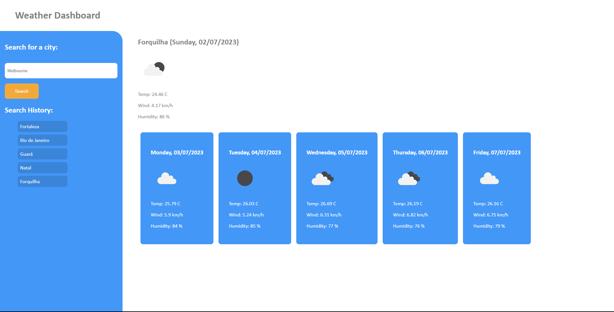

# Weather Dashboard



## Table of Contents

1. [Introduction](#introduction)
2. [Developer Comments](#developer-comments)
3. [Deployed Application](#deployed-application)
4. [References](#references)
5. [Creators](#creators)
6. [License](#license)

## Introduction

This is the week 6 challenge for the edX/Monash Bootcamp.  We were required to make a weather dashboard with the following Acceptance Criteria:

```md
GIVEN a weather dashboard with form inputs
WHEN I search for a city
THEN I am presented with current and future conditions for that city and that city is added to the search history
WHEN I view current weather conditions for that city
THEN I am presented with the city name, the date, an icon representation of weather conditions, the temperature, the humidity, and the the wind speed
WHEN I view future weather conditions for that city
THEN I am presented with a 5-day forecast that displays the date, an icon representation of weather conditions, the temperature, the wind speed, and the humidity
WHEN I click on a city in the search history
THEN I am again presented with current and future conditions for that city
```

## Developer Comments

In this challenge I faced a lot of problems, but was a lot quicker to solve them, than in the past.  In the challenge I used the OpenWeather API (<https://openweathermap.org/>) to get weather data, and the day.js API (<https://day.js.org/>) to format and manipulate dates/times.  The first problem I faced was how to make multiple fetch requests without making a fetch request inside the .then method of another fetch request.  Through this I learned about async and await; understanding this probably took me the most time.  Another problem I had was that the 5 day forecast API supplies 6 days, but the timestamps are not locked to the index of the array list.  So index 0 could me midnight, or it could be 9AM.  I solved this with a for loop to get the data I needed, but still there was another problem.  Due to the timestamps not being fixed to the index, if I wanted to get the weather for 12:00, the 12:00 timestamp may not exist on the 5th day, so my application would only render 4 days.  12:00 makes the most sense to display, but I had to take the midnight timestamp of each day due to the challenge requiring 5 days and does not state what timestamp needs to be displayed.

I made two API requests to grab weather conditions: one for the current weather and one for the 5 day forecast weather, both have a different path parameter. I think I could have made this function more elegantly, my goal was to use the same function for both requests and just substitute the path parameter, but in the end it feels a little clunky.  I used a separate request for the current weather because in the beginning I didn't like how the timestamps weren't locked to the index.

I really enjoyed this challenge, working with API's is pretty exciting as there's so much data that can be pulled from a request and it makes you think, what can I do with it?

## Deployed Application

<https://x4ndez.github.io/weatherdashboard/>

## References

OpenWeather API (<https://openweathermap.org/>)<br>
Day.js API (<https://day.js.org/>)

## Creators

**Xande** : <https://github.com/x4ndez>

## License

Code released under the MIT License.